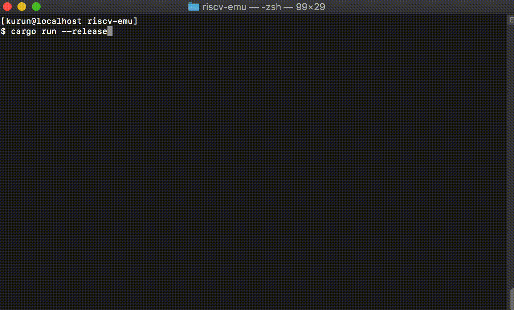

# riscv-emu

`riscv-emu` is a RISC-V emulator that is written in Rust.

## Demo

### NuttX


### xv6


## Support Status

### Instructions

- [x] RV32/64I
- [x] RV32/64M
- [ ] RV32/64F
- [ ] RV32/64D
- [ ] RV32/64V
- [x] RV32/64A
- [x] RV32/64C (Almost implemented)

### Virtual Memory

- [x] SV32
- [x] SV39
- [ ] SV48
- [ ] SV57
- [ ] SV64

### SoC/Peripherals

#### General
- [x] Uart (UART 16550)
- [x] Virtio Disk

#### [FU540-C000](https://static.dev.sifive.com/FU540-C000-v1.0.pdf))
- [x] CLINT (Timer)
- [x] PLIC (Interrupt Controller)

#### [FE310](https://static.dev.sifive.com/FE310-G000.pdf)
- [x] UART
- [x] PRCI
- [x] GPIO
- [x] SPI Flash
- [x] DTIM (SRAM)

### Support OS

 - [Nuttx](https://bitbucket.org/nuttx/nuttx/src/master/)
 - [xv6-riscv](https://github.com/mit-pdos/xv6-riscv)

## How to run

### NuttX

```
$ cargo run --release --features nuttx
```

### xv6

```
cargo run --release --features xv6
```

## Tests

### Instruction Regression Tests

```
$ cargo test
```

## Links

- [riscv/riscv-tests](https://github.com/riscv/riscv-tests)
